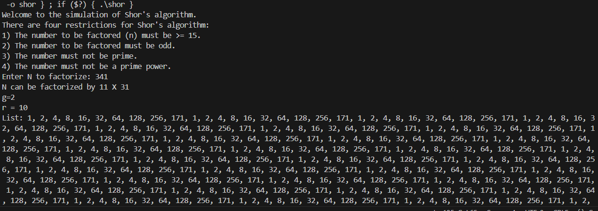
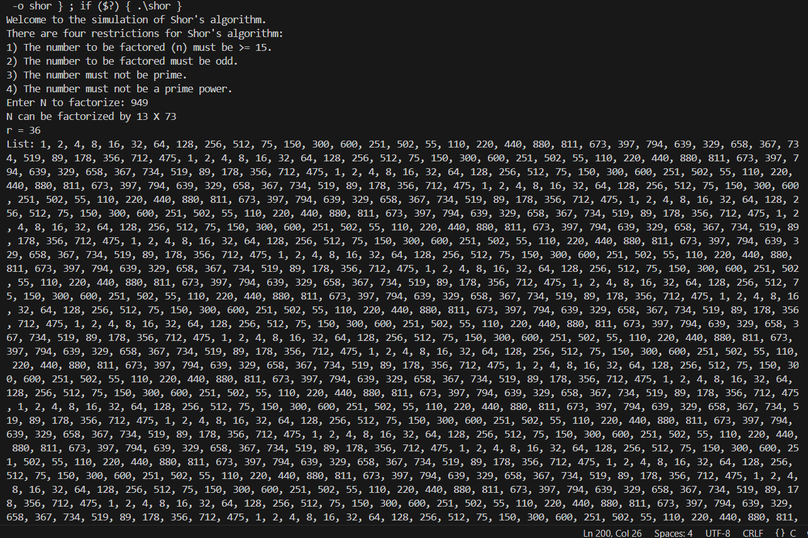

## Shor's algorithm simulation

In this repository be implemented by Shor's algorithm based on C-language
to simulate the number that can be factorized into two interger 

## Data structure
1. Linked list : Implemented by using linked list to eliminate static size of array

## How to run this project
1. If you do not have gcc compiler, then you can install it from https://gcc.gnu.org/ to run on VScode.       
2. Once you already install and set the environment path to the system, you can `cd real algorithm` and open with the VScode.       
3. click the top of right of conner to run the simulation. 

## Sample of figure
.png>)

